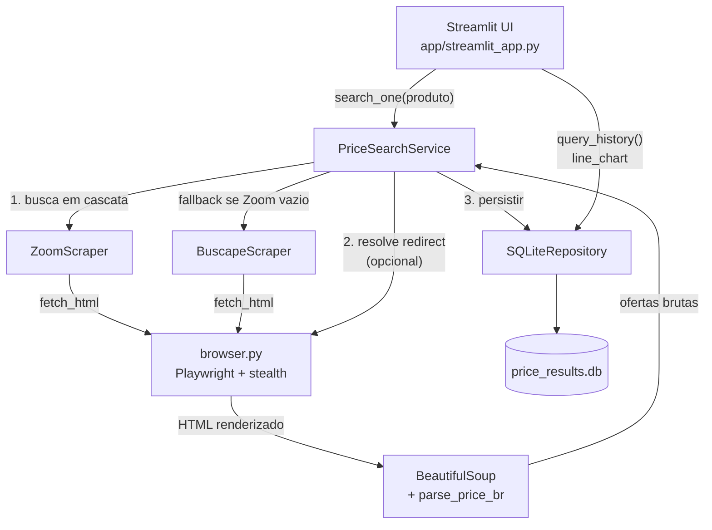

# Arquitetura

## Visão geral



## Componentes

### `browser.py`
Camada thin sobre Playwright. Duas funções públicas:
- `fetch_html(url)` — abre o browser headless com user-agent realista, injeta o init script de stealth (`navigator.webdriver = undefined`, fake `plugins`, `chrome.runtime`), espera `domcontentloaded` + um delay (`WAIT_MS`) para JS popular os cards, retorna o HTML final.
- `follow_redirect(url)` — abre o link de tracking do comparador e espera o `location.hostname` sair de `zoom.com.br`/`buscape.com.br`. Retorna a URL real do e-commerce.

### `scrapers/`
Cada comparador tem sua classe com a mesma interface (`Scraper` Protocol em `scrapers/base.py`):
- `search(product, max_results)` — lista candidatos da página de busca.
- `get_store_offers(url, max_offers)` — abre a página de produto e extrai ofertas por loja.

A separação entre **fetch** (browser.py) e **parse** (scraper) torna os parsers testáveis offline com HTMLs estáticos em `tests/fixtures/`.

### `service.py` — `PriceSearchService`
Orquestrador. Recebe `repository` e `scrapers` por injeção (DI por construtor — facilita teste e troca por outras fontes/persistência).

Fluxo de `search_one(product)`:
1. Itera `self.scrapers` em ordem; o primeiro que retornar resultados ganha (Zoom → Buscapé → ...).
2. Se `resolve_store_url=True`, para cada candidato:
   - Abre a página de produto e pega as ofertas;
   - Deduplica por URL;
   - Segue o redirect até a loja final.
3. Converte para `PriceResult` (com `queried_at`) e chama `repository.insert_many`.

### `storage/sqlite_repo.py`
Schema:

```sql
CREATE TABLE price_results (
    id            INTEGER PRIMARY KEY AUTOINCREMENT,
    queried_at    TEXT    NOT NULL,
    product_query TEXT    NOT NULL,
    product_title TEXT    NOT NULL,
    store         TEXT    NOT NULL,
    price         REAL    NOT NULL,
    url           TEXT    NOT NULL,
    source        TEXT    NOT NULL
);

CREATE INDEX idx_price_results_query
    ON price_results(product_query, queried_at);
```

O índice composto `(product_query, queried_at)` cobre as consultas principais do dashboard:
- `query_history(product)` — histórico ordenado por tempo.
- `latest_per_store(product)` — última cotação por loja, ordenada por preço.

### `app/streamlit_app.py`
Duas abas:
- **Resultados**: spinner durante a busca → tabela ordenada por preço + `st.metric` do menor preço.
- **Histórico de preços**: pivot por loja, plot via `st.line_chart`.

## Pontos de extensão

| Quero...                       | Onde mexer                                                    |
|--------------------------------|---------------------------------------------------------------|
| Adicionar Mercado Livre        | Criar `scrapers/mercadolivre.py` e adicionar à lista do service |
| Trocar SQLite por Postgres     | Implementar nova classe com a mesma interface de `SQLiteRepository` e injetar |
| Agendar coletas periódicas     | Wrapper que chama `service.search_one` para cada query num loop, com cron |
| Adicionar alertas              | Após `insert_many`, comparar com `latest_per_store` anterior e disparar webhook |
